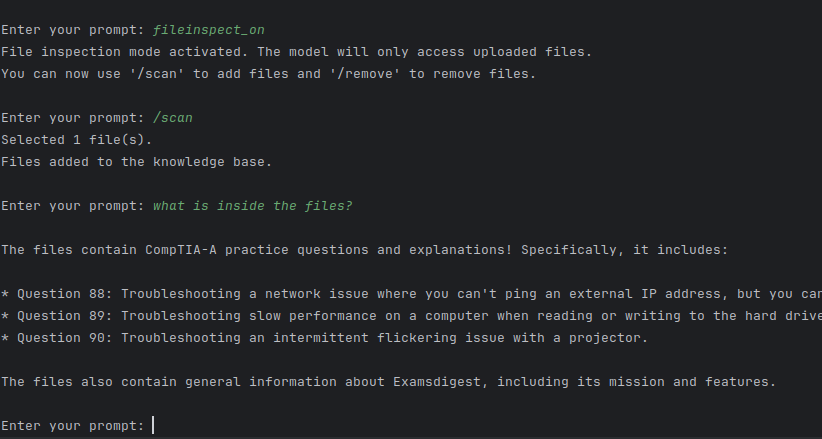

# 🤖 LocalAI Assistant (still in development) 🧠

> Installation & usage docs: [still an ongoing development]

LocalAI Assistant is a powerful, privacy-focused AI project that enables you to interact with your documents using the capabilities of Large Language Models (LLMs), even in offline scenarios. 100% private, ensuring your data never leaves your local environment.

The project provides a robust CLI interface offering all the primitives needed to build private, context-aware AI applications. It leverages the Llama 3 model via Ollama and supports both normal and streaming responses.

### Motivation/Reference

I was captivated by the Nvidia's tech called Chat with RTX where you can download it and run the AI chatbot locally where it can access your files, but it's so large and obviously i don't have an RTX gpu as well, and the feature where it can access your files, can assist you with it and explain the content is what made me invested in it. 

## 🎥 Overview

### Key Features

- 🏠 **Local Execution**: Runs entirely on your machine for enhanced privacy
- 💬 **Interactive CLI**: Seamless communication through a command-line interface
- 📁 **File Inspection Mode**: Analyze and query your personal documents
- 🔍 **Multi-format Support**: Works with TXT, PDF, DOCX, MD, PY, JS, HTML, CSS files
- 🧠 **Llama 3 Integration**: Utilizes the advanced Llama 3 model via Ollama
- ⚡ **Concurrent Processing**: Improved performance through parallel file processing
- 🔄 **Real-time Responses**: Stream AI responses as they're generated

## 🚀 Quick Start

### Prerequisites

- Ubuntu 20.04 or later
- Python 3.7+
- [Ollama](https://ollama.ai)

## ✨ Architecture

LocalAI Assistant is designed with modularity in mind:

- **CLI Interface**: Manages user input and command processing
- **Ollama Integration**: Interfaces with the Llama 3 model
- **File Processor**: Handles document ingestion and analysis
- **Knowledge Base**: Stores and retrieves information from processed documents
- **Response Generator**: Produces AI responses based on user input and available knowledge

## 🙏 Acknowledgements

- [Ollama](https://github.com/ollama/ollama) for local model serving capabilities
- [Llama 3](https://llama.meta.com/llama3/) for the underlying language model

---

